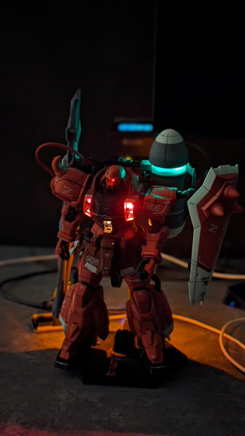

# GunplaESPKit

[Manage your Gunpla ESP Kit here](https://gunpla-esp-kit.vercel.app/)

## About

This code is designed for automating the LED control in my Gundam models using HomeAssistant (https://www.home-assistant.io/). Initially, I considered using ESPHome, but I needed more advanced features like power-on effects and diverse animations, particularly for elements like GN Drives.

## How it works

This software is composed of two parts. ESP32 Firmware and PWA React app that can upload firmware and configure HomeKit accessories on board. Web dashboard is using WebBluetooth to manage board and WebSerial to upload firmware. Everything stays in the browser.

## UI

## Example Gunpla

## Stack

GunplaESPKit is composed from two parts firmware and PWA web app to upload and manage firmware

### Firmware
Firmware is stored in root directory under src. It is using platform.io for managing dependencies and compiling.

- platform.io
- C++
- ESP32
- Arduino Framework
- HomeKit using [HomeSpan](https://github.com/HomeSpan/HomeSpan)
- Bluetooth using NimBLE
- MsgPack using ArduinoJson

### WebApp
Web app resides under `ui/` directory. It contains everything required to build final dashboard.

- Typescript
- Vitejs
- React
- Redux
- [Mantine UI](https://mantine.dev/)
- [WebBluetooth](https://caniuse.com/?search=webbluetooth)
- [WebSerial](https://caniuse.com/?search=Web%20Serial%20API)

## Requirements

* [platformio](https://platformio.org/)
* Python 3
* HomeAssistant or HomeKit
* ESP32 board with Bluetooth and WiFi

## Supported ESP32 dev kits

You need ESP32 kit with WiFi and bluetooth on board, 4 MB of memory.

- [Lolin S3 MINI](https://www.wemos.cc/en/latest/s3/s3_mini.html)
- [ESP32-DevKit](https://www.espressif.com/en/products/devkits/esp32-devkitc/overview)

## Disclaimer

🐒 Hey there! Just a heads-up: I, a singular, exceptionally skilled yet noticeably tipsy monkey, have rapidly put together the code you're about to see. It's worth mentioning that in my enthusiastic and slightly inebriated state, I completely skipped the testing phase. So, while you can expect some creative solutions, be prepared for a few surprises along the way. Enjoy the adventure and happy debugging! 🍌

## References

- https://www.youtube.com/watch?v=OsQObXu4TSA
- https://espressif-docs.readthedocs-hosted.com/projects/arduino-esp32/en/latest/api/ble.html
- https://github.com/improv-wifi/sdk-ble-js
- https://github.com/improv-wifi/sdk-ble-js/blob/0ddcc7d8ddcc37e648a08a5a4de102a085ed44ed/src/ble.ts#L109
- https://github.com/h2zero/NimBLE-Arduino/blob/release/1.4/examples/NimBLE_Server/NimBLE_Server.ino
- https://github.com/h2zero/NimBLE-Arduino/blob/release/1.4/docs/New_user_guide.md
- https://www.wemos.cc/en/latest/s3/s3_mini.html
- https://community.platformio.org/t/platformio-ini-file-for-esp32-s3-wroom-1-n4ct-nd/33526/2
- https://docs.espressif.com/projects/arduino-esp32/en/latest/tutorials/cdc_dfu_flash.html#usb-cdc
- https://github.com/oleksiikutuzov/esp32-homekit-led-strip/blob/main/src/main.cpp#L213
- https://randomnerdtutorials.com/esp32-https-requests/
- https://developer.mozilla.org/en-US/docs/Web/API/Bluetooth/requestDevice
- https://github.com/arkhipenko/TaskScheduler
- https://www.wemos.cc/en/latest/s2/s2_mini.html#pin
- https://learn.sparkfun.com/tutorials/esp32-ota-updates-over-ble-from-a-react-web-application/all
- https://github.com/HomeSpan/ProgrammableHub/blob/main/ProgrammableHub.ino
- https://github.com/kpatel122/ESP32-Web-Bluetooth-Terminal/tree/master
